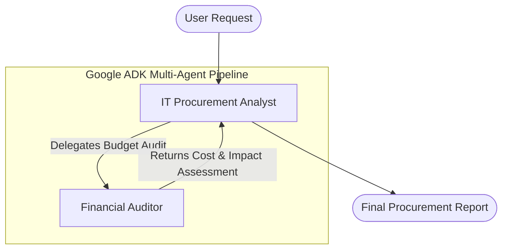

# Enterprise Multi-Agent Procurement & Financial Auditing System

This repository contains our capstone project for the Kaggle **"Agents for Business"** track. It implements an autonomous, code-first multi-agent system using the **Google Agent Development Kit (ADK)** to check enterprise software/hardware technology requests and audit their financial impact.

---

## 🏗️ Architecture

The system coordinates between two specialized agents to automate the validation and auditing pipeline:



1. **`IT_Procurement_Analyst` (Primary Agent)**:
   - Evaluates whether the incoming tech request is technically logical and conforms to standard enterprise IT needs.
   - Identifies the items (software, hardware, licenses) requested.
   - Delegates budget calculations, cost estimation, and financial feasibility checks to the secondary auditor.
   - Consolidates the technical and financial evaluations into a final structured report.

2. **`Financial_Auditor` (Secondary Agent / Sub-Agent)**:
   - Calculates the total one-time and annual recurring costs.
   - Evaluates the budget impact (High, Medium, or Low impact).
   - Enforces budgetary constraints and flags excessive or anomalies in pricing.

3. **`InMemoryRunner` (Execution Engine)**:
   - Manages the lifecycle and session state of the conversation in memory.
   - Streams event-driven agent thought processes and outputs.

---

## 🚀 Setup & Installation

### Prerequisites
- Python 3.10 or higher
- A Google Gemini API Key

### Installation

1. Clone the repository and navigate to the directory:
   ```bash
   cd Kaggle_Business_Agent
   ```

2. Install the `google-adk` package (which automatically includes `google-genai`):
   ```bash
   pip install google-adk
   ```

3. Set your Google API Key:
   - **PowerShell**:
     ```powershell
     $env:GOOGLE_API_KEY="your_api_key_here"
     ```
   - **Command Prompt**:
     ```cmd
     set GOOGLE_API_KEY=your_api_key_here
     ```
   - **Linux/macOS**:
     ```bash
     export GOOGLE_API_KEY="your_api_key_here"
     ```

4. Run the interactive application:
   ```bash
   python app.py
   ```

---

## 📊 Example Run: Software License Audit

Below is an example output showing the system auditing a request for **50 premium licenses at $200 per license** ($10,000 annual recurring cost).

### Input Request
> *"Our engineering team wants to purchase 50 premium licenses for an advanced data analysis tool. Each license costs $200/license."*

### Multi-Agent Interaction Log

```text
[IT_Procurement_Analyst] 
The engineering team's request to purchase 50 premium licenses for an advanced data analysis tool is technically logical. Data analysis tools are standard for engineering teams, and 50 licenses represent a standard department-wide allocation for a medium-to-large engineering organization.

I will delegate the financial impact calculation and constraint validation to the Financial Auditor.

[Financial_Auditor] 
Here is the financial audit of the software license request:

1. Cost Calculations:
   * Unit Cost: $200.00 per license
   * Quantity: 50 licenses
   * Total Recurring Annual Cost: 50 * $200.00 = $10,000.00 / year

2. Budget Impact Evaluation:
   * Total Recurring Cost: $10,000.00 per year.
   * Assessment: This expense represents a **Medium Financial Impact**. While $10,000/year is a notable operational expense, it is typical for specialized, business-critical software tools across 50 users.

3. Budgetary Constraints & Warnings:
   * The unit rate of $200/license is within the expected industry average for premium data analysis software.
   * No excessive pricing anomalies were detected. The recurring expense does not appear to be excessive.
```
